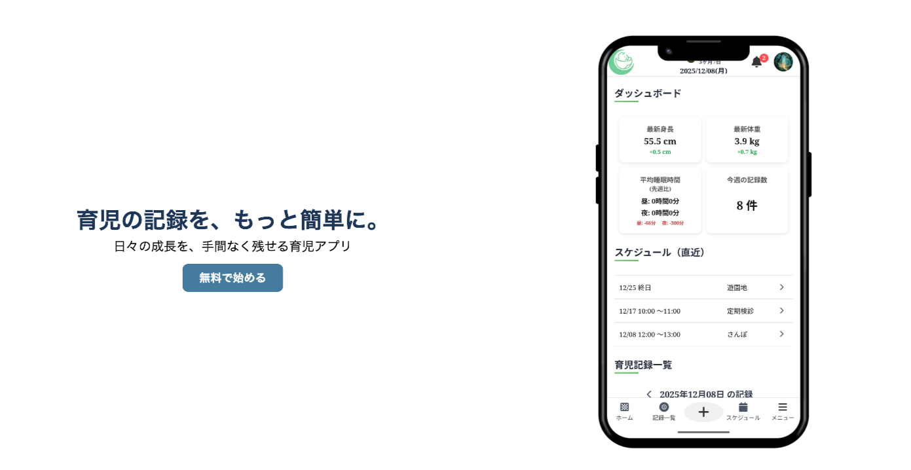
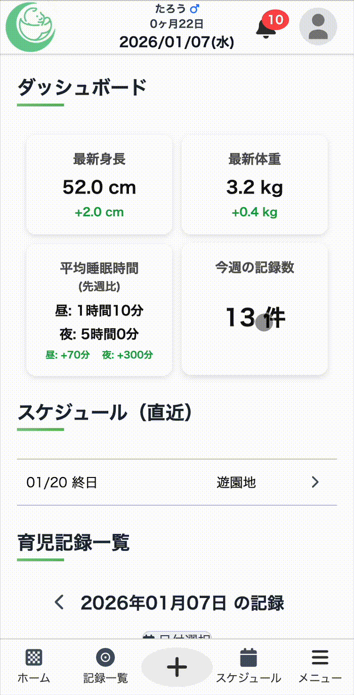
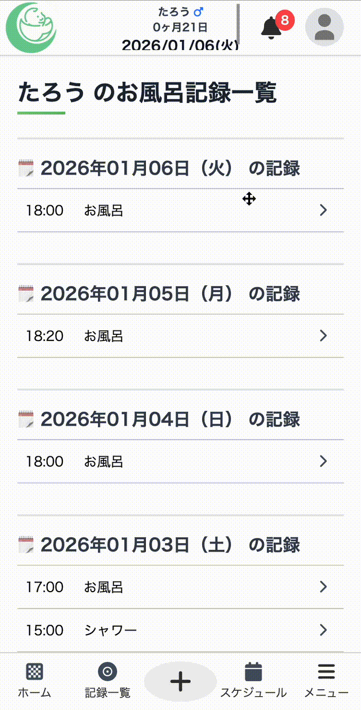
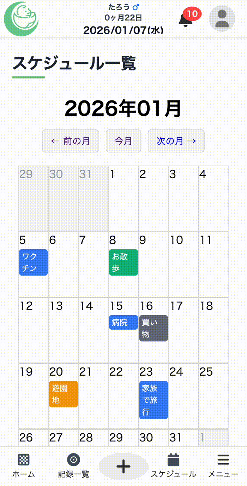
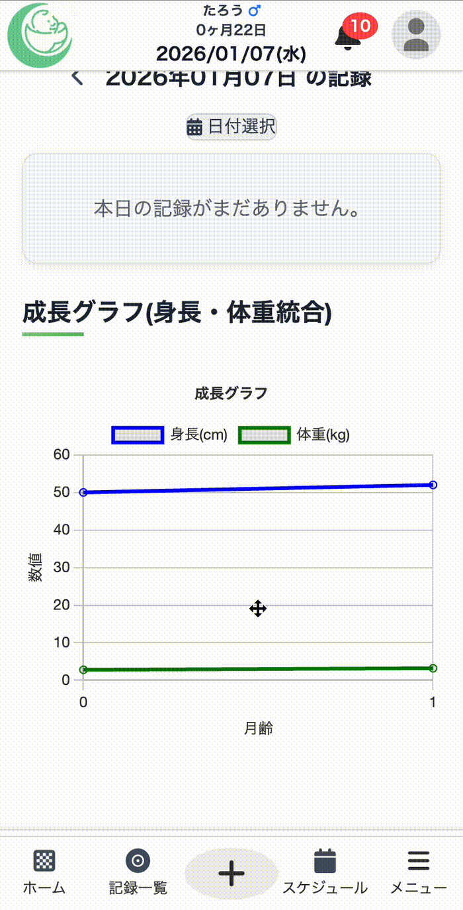
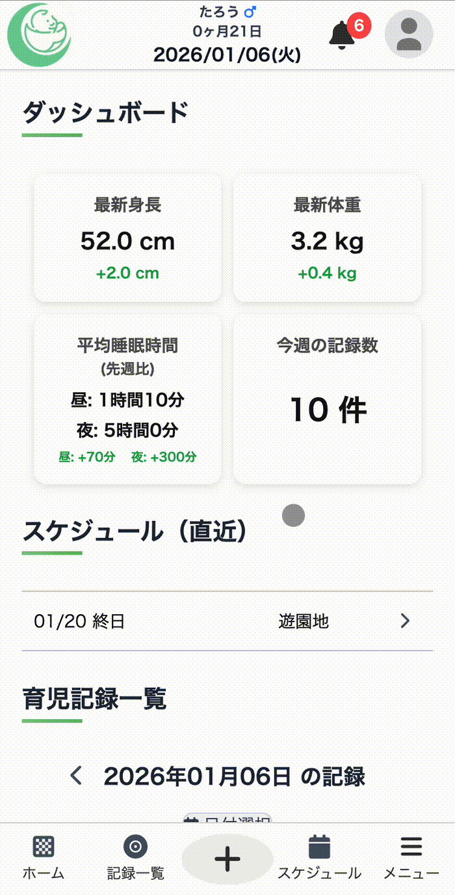
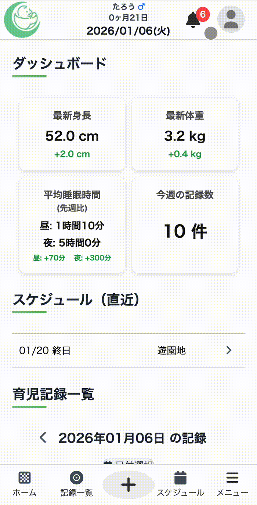
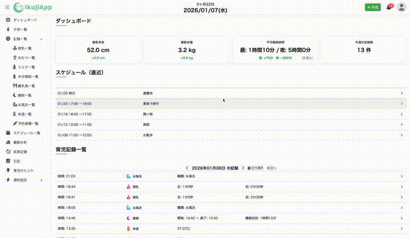
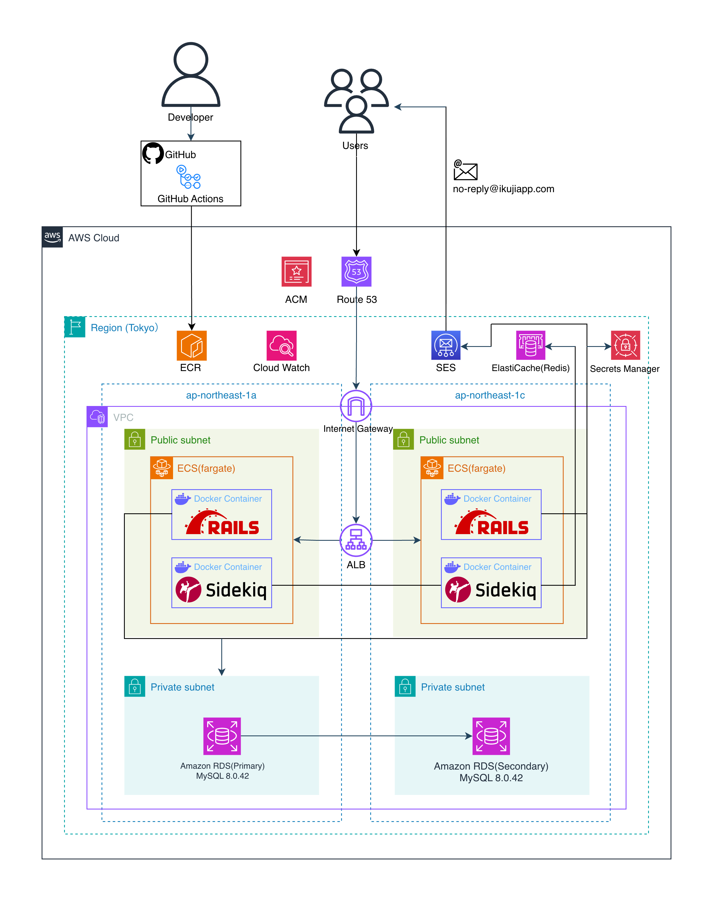
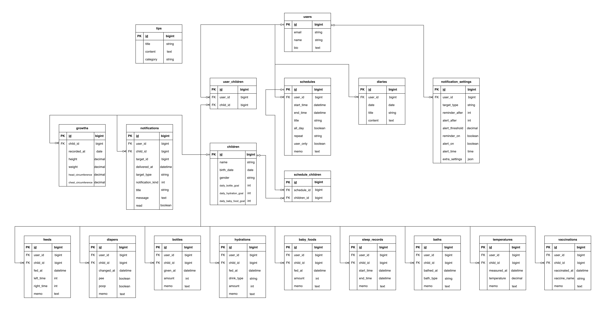

# IkujiApp / 育児記録サービス

## サービス概要

### ▼ サービスURL

https://www.ikujiapp.com

※現在ルートドメイン（ikujiapp.com）でのアクセスが不可となっております。
サブドメインは可能ですのでご了承ください。（www.ikujiapp.com）

### ▼ Qiita紹介記事 

https://qiita.com/taaa_09/items/c80e7ee080976d153bb5

### ▼ 概要

IkujiApp は、「シンプルな操作性」と「十分な機能性」を両立した育児記録Webアプリです。

既存の育児記録アプリには、大きく分けて2つの傾向があります。
1つは、入力や画面が非常にシンプルで使いやすい一方、機能面では物足りなさを感じるもの。
もう1つは、多機能で情報量が豊富な反面、操作が複雑で慣れるまで時間がかかるものです。

実際に身近な育児の現場では、
「シンプルで使いやすいが、もう少し記録したい」
「機能は豊富だが、操作に迷ってしまい継続できない」
という声を聞きました。

IkujiApp はこのギャップを解消することを目的に開発しました。
画面構成や入力導線はできる限りシンプルに保ちつつ、
まめに記録したいユーザーにも応えられるよう、以下のような機能を備えています。

- 記録作成
- 各項目ごとの記録一覧
- 日毎の記録まとめ
- スケジュールカレンダー
- 成長記録グラフ
- 睡眠分析
- リアルタイム通知機能
- 育児情報Tips
- 日記機能
- ダッシュボード
- ダークモード

また、PCではサイドバー、スマートフォン・タブレットでは
SNSアプリのようなナビゲーションを採用し、
デバイスを問わず直感的に操作できるUIを意識しています。

「簡単に使いたい人」と「しっかり記録したい人」の両方にとって、
無理なく続けられる育児記録アプリを目指しています。

### ▼ 開発者Xアカウント

https://x.com/taaa_099

### ▼ Qiitaアカウント

https://qiita.com/taaa_09

### ▼ はてなブログアカウント

https://taaa-0991.hatenablog.com

日々の開発成果などを主に投稿しております。

## メイン機能の使い方

<table>
  <tr>
    <th align="center">子供を切り替える</th>
    <th align="center">記録作成・一覧表示</th>
    <th align="center">スケジュール管理</th>
    <th align="center">成長記録・睡眠分析</th>
  </tr>
  <tr>
    <td align="center" valign="top">
      
      

        子供を切り替えて表示できるため、兄弟・姉妹それぞれの記録を分けて管理できます。
      

    </td>
    <td align="center" valign="top">
      
      

        ナビゲーションバーから各記録を入力し、ワンタップで登録できます。記録は項目別・日別の一覧やダッシュボードからまとめて確認できます。
      

    </td>
    <td align="center" valign="top">
      
      

        家族ごとの予定をカレンダーで一元管理でき、育児や生活のスケジュールを把握しやすくします。
      

    </td>
    <td align="center" valign="top">
      
      

        成長の推移や睡眠状況をグラフで可視化し、日々の変化を直感的に確認できます。
      

    </td>
  </tr>
</table>

## 利便性を高めるその他の機能

<table>
  <tr>
    <th align="center">リアルタイム通知</th>
    <th align="center">ダークモード対応</th>
    <th align="center">レスポンシブ対応</th>
  </tr>
  <tr>
    <td align="center" valign="top">
      
      

        記録や予定に応じて、リアルタイムで通知が届きます。
        通知のON/OFFや時間は設定画面から柔軟にカスタマイズできます。
      

    </td>
    <td align="center" valign="top">
      
      

        ダークモードに対応しており、夜間や暗い環境でも
        目に優しく快適に記録できます。
      

    </td>
    <td align="center" valign="top">
      
      

        PC版でもサイドバーを活用でき、
        大画面で快適に利用できます。
      

    </td>
  </tr>
</table>

## 使用技術

<table style="width:100%; border-collapse: collapse; border:1px solid;">
  <tr>
    <th style="border:1px solid; padding:8px; text-align:left;">カテゴリ</th>
    <th style="border:1px solid; padding:8px; text-align:left;">技術</th>
  </tr>
  <tr>
    <td style="border:1px solid; padding:8px;"><b>フロントエンド</b></td>
    <td style="border:1px solid; padding:8px;">
        主要言語：HTML / CSS / JavaScript 
        非同期通信・画面遷移：Hotwire Turbo 
        CSSフレームワーク：Tailwind CSS 4.1.11 
        グラフ描画：Chart.js 4.5.0 
        UI補助：Stimulus 
        ビルド・実行環境：Node.js 20.19.6 / Yarn 1.22.22 / esbuild（JavaScript依存管理・アセットバンドル） 
        主要パッケージ：Font Awesome
    </td>
  </tr>
  <tr>
    <td style="border:1px solid; padding:8px;"><b>バックエンド</b></td>
    <td style="border:1px solid; padding:8px;">
      言語：Ruby 3.4.4 
      フレームワーク：Rails 8.0.2 
      認証：Devise 
      非同期処理：Sidekiq 
      リアルタイム通信：Action Cable 
      テスト：RSpec 
      コード解析 / フォーマッター: Rubocop
    </td>
  </tr>
  <tr>
    <td style="border:1px solid; padding:8px;"><b>データベース</b></td>
    <td style="border:1px solid; padding:8px;">
      MySQL 8.0.42
    </td>
  </tr>
  <tr>
    <td style="border:1px solid; padding:8px;"><b>インフラ</b></td>
    <td style="border:1px solid; padding:8px;">
      AWS（ECS Fargate / ECR / ALB / VPC / RDS / ElastiCache（Redis） / Route 53 / Secrets Manager / IAM）
    </td>
  </tr>
  <tr>
    <td style="border:1px solid; padding:8px;"><b>CI/CD</b></td>
    <td style="border:1px solid; padding:8px;">
      GitHub Actions
    </td>
  </tr>
  <tr>
    <td style="border:1px solid; padding:8px;"><b>環境構築</b></td>
    <td style="border:1px solid; padding:8px;">
      Docker / Docker Compose
    </td>
  </tr>
</table>

## 主要対応一覧

### ユーザー向け

#### 機能

- ユーザー
  - メールアドレス / パスワードでのユーザー登録・ログイン
  - ユーザー情報編集・プロフィール更新
  - パスワード再設定
  - 退会機能
- 子ども
  - 登録・更新・削除 / 一覧表示
  - プロフィール更新
  - 子ども切り替え機能
- 育児記録
  - 作成・編集・削除 / 一覧表示
    - 対応項目：授乳 / おむつ / ミルク / 水分補給 / 離乳食 / 睡眠 / お風呂 / 体温 / 予防接種 / スケジュール / 成長 / 日記
  - 補足機能：
    - 睡眠：睡眠分析グラフ表示
	- 成長：身長・体重などの成長記録、成長グラフ表示
	- スケジュール：カレンダー表示
	- 日記：画像アップロード / 日付指定での絞り込み
- ダッシュボード
    - 「平均身長・体重（先週比）」「平均睡眠時間（先週比）」「今週の記録数」
    - 「スケジュール一覧（直近５件）」「育児記録一覧（日付別）」「成長記録グラフ（身長・体重統合版）」
- お役立ち情報配信
- 通知
  - リアルタイム通知送信
  - ベルマーク一覧表示
  - 通知設定
- デザインテーマ
  - ライトモード
  - ダークモード

#### 画面

- トースト表示
- モーダル画面
- カードビュー（ダッシュボード・睡眠分析）
- 折りたたみ機能付きサイドバー（PC版）
- ナビゲーションバー（スマホ版）
- グラフ表示（育児記録・成長記録）
- カレンダー表示（スケジュール）
- 日記画像プレビュー
- レスポンシブデザイン

### 非ユーザー向け

#### システム / インフラ

- Dockerによる開発環境のコンテナ化
- Route53による独自ドメイン + SSL化
- GitHub ActionsによるCI / CDパイプラインの構築
  - CI: Rubocop / RSpec
  - CD: AWS ECS

#### テスト

- クロスブラウザテスト

  - PC
    - Windows11: Google Chrome / Microsoft Edge
    - Mac: Google Chrome /  Safari
  - スマートフォン
    - Android: Google Chrome
    - iOS: Safari

- RSpec
  - 単体テスト（model）
  - 結合テスト（request）

#### パフォーマンス / 最適化

- Hotwire Turbo / Stimulus を活用した非同期通信・画面高速化

## インフラ構成図

## ER図

